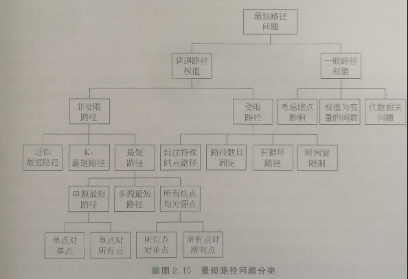

# planning and Control

## Routing
<!-- 中国智能车挑战赛， 路网定义文件RNDF -->
### define:

HD-Map

RoadGraph

RoadPoints(撒点，构建权重图，得到可以规划的图)

### main method: 
$A^*$, $Dijkstra$

## Behavioral Decision
细节上的决策

## Motion Planning
全局规划

## Control

主要算法运用强化学习。

## 算法介绍
### Dijkstra 算法
迭代求解，贪心算法。同理的还有Floyd算法。 

### $A^*$ 算法
基于Dijstra算法的思量，启发式搜索。

### RRT
一种算法并且是一种结构。
有效的进行高维空间搜索。

### 互补约束的数学规划方法
MPCC 和 RS函数。

